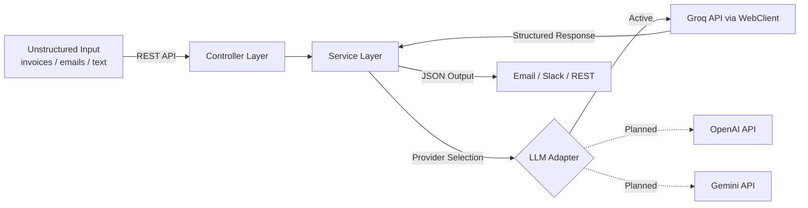

# AI Logistics Automation Hub


> **Intelligent Document-to-JSON Extractor** | Java 17 · Spring Boot 3 · WebClient · Groq AI

A professional-grade backend service that converts unstructured documents (invoices, emails, reports) into structured JSON using LLM APIs. Built with a modern, non-blocking architecture for high performance and reliability.

## 💰 Business Impact

Automates the **first mile** of logistics back-office work: supplier invoices, dispatch logs, and delay alerts arrive as unstructured text — this service extracts structured fields (vendor, dates, amounts, status, urgency) and routes them to REST, email, or Slack.

- **Less manual re-keying** — replaces copy-paste into spreadsheets or internal tools for the scenarios in [`docs/demo-guide.md`](docs/demo-guide.md).
- **Faster ops response** — urgent delays and invoice totals surface in a consistent JSON shape for downstream automation.
- **Adaptable AI backend** — LLM vendor is isolated behind a port/adapter boundary (see [Customization](#-customization--extensibility) below).

---

## 🎬 See It in Action

**Live Dashboard — Real-time AI extraction with color-coded status badges:**


**📹 Narrated demo (~60s):**

[](https://youtu.be/TULulfYLYKE)

**▶ [Watch on YouTube — AI Logistics Hub Demo](https://youtu.be/TULulfYLYKE)**

To reproduce the recording locally, see [dev-video-automation](https://github.com/HectorCorbellini/dev-video-automation).

> ### 🚀 Work with Me
>
> **For employers** — This repo reflects my engineering standards: Java 17, Spring Boot 3, tested AI integration, `WebClient`, CI, and Docker. [Discuss senior engineering roles on LinkedIn](https://www.linkedin.com/in/h%C3%A9ctor-corbellini-726553221/).
>
> **For businesses** — Need to automate data entry from emails/invoices, parse high-volume client messages, or integrate LLMs into a legacy backend with clear boundaries? I build tailored automation pipelines on this foundation. [LinkedIn](https://www.linkedin.com/in/h%C3%A9ctor-corbellini-726553221/) · strategic context in [`ANALYSIS.md`](ANALYSIS.md).

---

### ⚡ Quick Showcase: From Text to JSON

**Input (Raw Email/Invoice Text):**
```text
Subject: Invoice from ACME Corp
Date: Jan 20, 2026
Total: $2,450.50
Notes: Please process by EOD.
```

**Output (Structured JSON):**
```json
{
  "companyName": "ACME Corp",
  "date": "2026-01-20",
  "totalAmount": 2450.5
}
```

---

## 🏗️ How It Works



1. **Input** — Raw text is sent to the REST endpoint.
2. **Service Layer** — Applies extraction rules and coordinates with the selected AI provider.
3. **LLM Adapter** — Sends a structured prompt to Groq using non-blocking **WebClient** and receives pure JSON.
4. **Output** — Validated JSON is persisted in H2, dispatched to Email/Slack, or returned via REST.

### 🌉 The "Bridge" Concept
While the **Hub** represents the central automation station, the **Bridge** (`logistics-ai-bridge`) describes the core architectural function: connecting unstructured logistics data to modern AI processing, and bridging the gap between raw document inputs and the operational tools teams use daily.

---

## Features

- **AI-Powered Data Extraction** — Uses Groq AI to intelligently parse and structure raw text (Company, Date, Amount).
- **Reactive-Ready Architecture** — Powered by Spring WebFlux's `WebClient` for efficient, non-blocking API interactions.
- **Email Integration** — Automatically sends formatted extraction results via SMTP.
- **Slack Integration** — Posts extracted results to a configured Slack channel via Webhook.
- **RESTful API** — Clean endpoints for extraction, notification dispatch, and demo resets.
- **Interactive API Docs** — Swagger UI available at `/swagger-ui/index.html` for live testing.
- **Containerized** — Includes a `Dockerfile` for easy deployment and scaling.

---

## Project Context & Architecture

This project showcases a professional approach to **AI integration** and **Clean Coding**. It follows a **Layered Architecture** with a growing **ports-and-adapters** boundary for LLM providers:

| Layer | Responsibility |
|---|---|
| **Controllers** | Handle HTTP requests and delegate to services |
| **Services** | Business logic and extraction orchestration (`AIService` owns prompts) |
| **Ports** | `AIProvider` — contract for any LLM backend |
| **Adapters** | `GroqAIProvider` — `WebClient` calls to Groq today |
| **Repositories** | Spring Data JPA persistence |
| **DTOs / Models** | Typed API contracts |

### Architectural Principles

- **Separation of concerns** — controllers delegate; services orchestrate; adapters talk to external APIs.
- **Provider decoupling** — Groq-specific HTTP lives in `GroqAIProvider`, not in `AIService`.
- **Resilient configuration** — secrets and URLs via environment variables / `application.yml`.
- **Statelessness** — services remain stateless for horizontal scaling.

Details: [`docs/ai-integration.md`](docs/ai-integration.md) · roadmap: [`docs/roadmap.md`](docs/roadmap.md).

---

## 🔌 Customization & Extensibility

The extraction **schema and prompts** stay in the application layer; the **LLM transport** is swappable:

| Today | Planned (same `AIProvider` port) |
|---|---|
| Groq (Llama 3.1) via `GroqAIProvider` | OpenAI, Gemini adapters |
| Config: `GROQ_API_KEY`, `application.yml` | Provider selection via Spring config / profile |

**For compliance-sensitive deployments**, you can add an adapter for your chosen stack — e.g. OpenAI Enterprise, Google Gemini, or a **self-hosted OpenAI-compatible endpoint** (Ollama, vLLM, on-prem Llama) — without rewriting extraction logic. That is an adapter + configuration task, not a greenfield rebuild.

Email, Slack, and persistence are still Spring-coupled; decoupling them behind notification/repository ports is on the [roadmap](docs/roadmap.md) (Phase 7).

---

## 🚀 Showcase Scenarios

Explore real-world logistics automation stories (Delayed Shipment Alerts, Invoice Routing, and Operations Digests) in our [Showcase Guide (docs/demo-guide.md)](docs/demo-guide.md).

---
