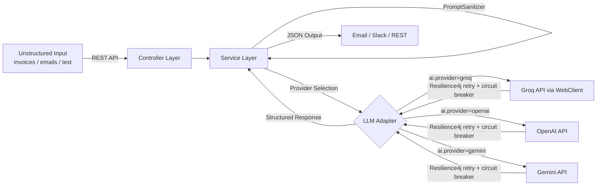

# AI Logistics Automation Hub


> **Intelligent Document-to-JSON Extractor** | Java 17 · Spring Boot 3 · WebClient · Groq · OpenAI · Gemini

A professional-grade backend service that converts unstructured documents (invoices, emails, reports) into structured JSON using LLM APIs. Built with a modern, non-blocking architecture for high performance and reliability.

## 💰 Business Impact

Automates the **first mile** of logistics back-office work: supplier invoices, dispatch logs, and delay alerts arrive as unstructured text — this service extracts structured fields (vendor, dates, amounts, status, urgency) and routes them to REST, email, or Slack.

- **Less manual re-keying** — replaces copy-paste into spreadsheets or internal tools for the scenarios in [`docs/demo-guide.md`](docs/demo-guide.md).
- **Faster ops response** — urgent delays and invoice totals surface in a consistent JSON shape for downstream automation.
- **Adaptable AI backend** — LLM vendor is isolated behind a port/adapter boundary (see [Customization](#-customization--extensibility) below).

---

## 🎬 See It in Action

**Live Dashboard — Real-time AI extraction with color-coded status badges:**


**📹 Narrated demo (~60s):**

[](https://youtu.be/TULulfYLYKE)

**▶ [Watch on YouTube — AI Logistics Hub Demo](https://youtu.be/TULulfYLYKE)**

To reproduce the recording locally, see [dev-video-automation](https://github.com/HectorCorbellini/dev-video-automation).

> ### 🚀 Work with Me
>
> **For employers** — This repo reflects my engineering standards: Java 17, Spring Boot 3, tested AI integration, `WebClient`, CI, and Docker. [Discuss senior engineering roles on LinkedIn](https://www.linkedin.com/in/h%C3%A9ctor-corbellini-726553221/).
>
> **For businesses** — Need to automate data entry from emails/invoices, parse high-volume client messages, or integrate LLMs into a legacy backend with clear boundaries? I build tailored automation pipelines on this foundation. [LinkedIn](https://www.linkedin.com/in/h%C3%A9ctor-corbellini-726553221/) · strategic context in [`ANALYSIS.md`](ANALYSIS.md).

---

### ⚡ Quick Showcase: From Text to JSON

**Input (Raw Email/Invoice Text):**
```text
Subject: Invoice from ACME Corp
Date: Jan 20, 2026
Total: $2,450.50
Notes: Please process by EOD.
```

**Output (Structured JSON):**
```json
{
  "companyName": "ACME Corp",
  "date": "2026-01-20",
  "totalAmount": 2450.5
}
```

---

## 🏗️ How It Works



1. **Input** — Raw text is sent to the REST endpoint.
2. **Service Layer** — Sanitizes input against prompt injection, applies extraction rules, and coordinates with the selected AI provider.
3. **LLM Adapter** — Sends a structured prompt via non-blocking **WebClient**, protected by a **Resilience4j** retry + circuit breaker. Supports Groq, OpenAI, and Gemini — switchable via `application.yml`.
4. **Output** — Validated JSON is persisted in H2, dispatched to Email/Slack, or returned via REST.

### 🌉 The "Bridge" Concept
While the **Hub** represents the central automation station, the **Bridge** (`logistics-ai-bridge`) describes the core architectural function: connecting unstructured logistics data to modern AI processing, and bridging the gap between raw document inputs and the operational tools teams use daily.

---

## Features

- **AI-Powered Data Extraction** — Groq, OpenAI, and Gemini adapters; switch providers with one line in `application.yml`.
- **Resilient AI Calls** — Resilience4j retry (3 attempts, 1 s back-off) and circuit breaker (opens at 50 % failure rate) on every LLM call.
- **Prompt Injection Protection** — `PromptSanitizer` blocks known injection phrases and wraps user input in structural `<user_input>` delimiters before it reaches the model.
- **Reactive-Ready Architecture** — Powered by Spring WebFlux's `WebClient` for efficient, non-blocking API interactions.
- **Email Integration** — Automatically sends formatted extraction results via SMTP.
- **Slack Integration** — Posts extracted results to a configured Slack channel via Webhook.
- **RESTful API** — Clean endpoints for extraction, notification dispatch, and demo resets.
- **Interactive API Docs** — Swagger UI available at `/swagger-ui/index.html` for live testing.
- **Containerized** — Includes a `Dockerfile` for easy deployment and scaling.

---

## Project Context & Architecture

This project showcases a professional approach to **AI integration** and **Clean Coding**. It follows a **Layered Architecture** with a growing **ports-and-adapters** boundary for LLM providers:

| Layer | Responsibility |
|---|---|
| **Controllers** | Handle HTTP requests and delegate to services |
| **Services** | Business logic, prompt sanitization, and extraction orchestration |
| **Ports** | `AIProvider`, `ExtractionStore`, `NotificationPort` — contracts for all external dependencies |
| **Adapters** | `GroqAIProvider`, `OpenAIProvider`, `GeminiAIProvider` · `JpaExtractionStore` · `EmailNotificationAdapter`, `SlackNotificationAdapter` |
| **Resilience** | `AIProviderResilienceDecorator` — Resilience4j retry + circuit breaker on all LLM calls |
| **DTOs / Models** | Typed API contracts |

### Architectural Principles

- **Separation of concerns** — controllers delegate; services orchestrate; adapters talk to external APIs.
- **Full hexagonal boundary** — AI providers, persistence, and notifications are all behind ports. Swapping any of them is an adapter + config change, not a service rewrite.
- **Provider decoupling** — select Groq, OpenAI, or Gemini via `ai.provider` in `application.yml`; no code changes needed.
- **Production resilience** — Resilience4j retry and circuit breaker protect every LLM call from rate-limits and transient failures.
- **Security by default** — prompt injection is mitigated at the service layer before input reaches the model.
- **Resilient configuration** — secrets and URLs via environment variables / `application.yml`.
- **Statelessness** — services remain stateless for horizontal scaling.

Details: [`docs/ai-integration.md`](docs/ai-integration.md) · roadmap: [`docs/roadmap.md`](docs/roadmap.md).

---

## 🔌 Customization & Extensibility

The extraction **schema and prompts** stay in the application layer; the **LLM transport** is fully swappable:

| Provider | Adapter | Config key |
|---|---|---|
| Groq (Llama 3.1) — **default** | `GroqAIProvider` | `ai.provider: groq` |
| OpenAI | `OpenAIProvider` | `ai.provider: openai` |
| Google Gemini | `GeminiAIProvider` | `ai.provider: gemini` |

Set `ai.provider` in `application.yml` and supply the corresponding API key env var (`GROQ_API_KEY`, `OPENAI_API_KEY`, or `GEMINI_API_KEY`). No code changes required.

**For compliance-sensitive deployments**, point `openai.api.url` at a self-hosted OpenAI-compatible endpoint (Ollama, vLLM, on-prem Llama) — the adapter works without modification.

Email, Slack, and persistence are each behind their own port (`NotificationPort`, `ExtractionStore`), so they are equally swappable.

---

## 🚀 Showcase Scenarios

Explore real-world logistics automation stories (Delayed Shipment Alerts, Invoice Routing, and Operations Digests) in our [Showcase Guide (docs/demo-guide.md)](docs/demo-guide.md).

To verify the running application end-to-end (AI extraction, email, Slack, and prompt injection rejection), run the included smoke test:

```bash
# Requires curl and jq
./verify_usage.sh

# Custom target or email
./verify_usage.sh http://localhost:8080/api your@email.com
```

The script exits with a non-zero code on any failure, making it suitable for CI post-deploy checks.

---
