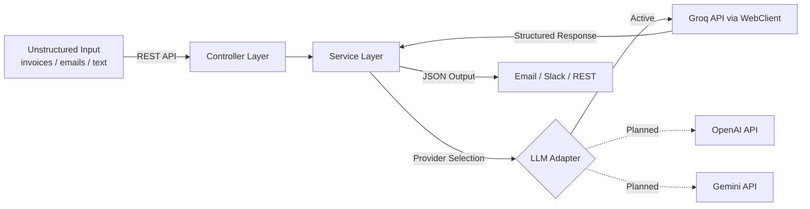

# AI Logistics Automation Hub


> **Intelligent Document-to-JSON Extractor** | Java 17 · Spring Boot 3 · WebClient · Groq AI

A professional-grade backend service that converts unstructured documents (invoices, emails, reports) into structured JSON using LLM APIs. Built with a modern, non-blocking architecture for high performance and reliability.

---

## 🎬 See It in Action

**Live Dashboard — Real-time AI extraction with color-coded status badges:**


**📹 Watch the full narrated demo (~60s):** [`final_showcase_with_audio.webm`](video-recorder/videos/final_showcase_with_audio.webm)

> 💼 **Hiring?** This project demonstrates production-grade AI integration, reactive-ready architecture, and full-stack delivery — [let's talk](https://www.linkedin.com/in/h%C3%A9ctor-corbellini-726553221/).

---

### ⚡ Quick Showcase: From Text to JSON

**Input (Raw Email/Invoice Text):**
```text
Subject: Invoice from ACME Corp
Date: Jan 20, 2026
Total: $2,450.50
Notes: Please process by EOD.
```

**Output (Structured JSON):**
```json
{
  "companyName": "ACME Corp",
  "date": "2026-01-20",
  "totalAmount": 2450.5
}
```

---

## 🏗️ How It Works



1. **Input** — Raw text is sent to the REST endpoint.
2. **Service Layer** — Applies extraction rules and coordinates with the selected AI provider.
3. **LLM Adapter** — Sends a structured prompt to Groq using non-blocking **WebClient** and receives pure JSON.
4. **Output** — Validated JSON is persisted in H2, dispatched to Email/Slack, or returned via REST.

---

## Features

- **AI-Powered Data Extraction** — Uses Groq AI to intelligently parse and structure raw text (Company, Date, Amount).
- **Reactive-Ready Architecture** — Powered by Spring WebFlux's `WebClient` for efficient, non-blocking API interactions.
- **Email Integration** — Automatically sends formatted extraction results via SMTP.
- **Slack Integration** — Posts extracted results to a configured Slack channel via Webhook.
- **RESTful API** — Clean endpoints for extraction, notification dispatch, and demo resets.
- **Interactive API Docs** — Swagger UI available at `/swagger-ui/index.html` for live testing.
- **Containerized** — Includes a `Dockerfile` for easy deployment and scaling.

---

## Project Context & Architecture

This project showcases a professional approach to **AI integration** and **Clean Coding**. It follows a **Layered Architecture** with a focus on **Reactive** patterns:

| Layer | Responsibility |
|---|---|
| **Controllers** | Handle HTTP requests and delegate to services |
| **Services** | Core business logic and AI extraction orchestration |
| **Adapters** | Modern `WebClient` implementations for external AI providers |
| **Repositories** | Abstract data access via Spring Data JPA |
| **DTOs / Models** | Typed data structures for clean API contracts |

### Architectural Principles
While pragmatic, the project respects core **Clean Architecture** principles:
- **Separation of Concerns**: Each layer has a single, well-defined responsibility.
- **Modern Networking**: Replaced legacy `RestTemplate` with `WebClient` for future-proof scalability.
- **Resilient Configuration**: Fallback defaults for environment variables ensure zero-config startup for evaluation.
- **Statelessness**: The service layer remains stateless to support easy scaling.

---

## 🚀 Showcase Scenarios

Explore real-world logistics automation stories (Delayed Shipment Alerts, Invoice Routing, and Operations Digests) in our [Showcase Guide (docs/demo-guide.md)](docs/demo-guide.md).

---
