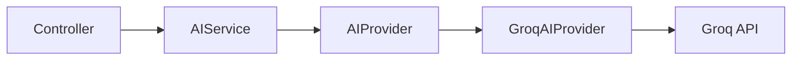

# AI Integration Guide

This project integrates with LLM providers to perform intelligent data extraction. The active provider is **Groq** (Llama 3.1), implemented behind a port/adapter boundary so additional backends can be added without changing prompt orchestration.

## Architectural Design

1. **DTO-based communication**
   - `ExtractionRequest` — raw text input.
   - `AIResponse` — structured JSON from the LLM (`companyName`, `date`, `totalAmount`, `category`, `status`, `isUrgent`).

2. **Application layer (`AIService`)**
   - Builds domain prompts (JSON-only contract, logistics fields).
   - Delegates HTTP to `AIProvider` — no Groq-specific client code in this class.
   - Validates input (non-empty text) before calling the port.

3. **Port (`AIProvider`)**
   - Interface in `com.example.apibridge.port.AIProvider`.
   - Single method: `AIResponse extract(String prompt)`.

4. **Adapter (`GroqAIProvider`)**
   - Implements `AIProvider` using Spring **`WebClient`** (non-blocking).
   - Configuration via `application.yml`: `groq.api.key`, `groq.api.url`, `groq.model`.
   - Parses LLM responses (including markdown code fences) into `AIResponse`.



## Adding Another Provider

To support OpenAI, Gemini, or a self-hosted OpenAI-compatible API:

1. Create a new class implementing `AIProvider` (e.g. `OpenAIProvider`, `GeminiAIProvider`, `OllamaProvider`).
2. Map configuration in `application.yml` (API URL, key, model).
3. Register the bean and wire it into `AIService` (constructor injection), or add a profile/property to select the active provider.
4. Reuse the same prompt from `AIService`; only transport and response parsing differ per vendor.

See [`docs/roadmap.md`](roadmap.md) Phase 7 for notification/persistence decoupling (separate from LLM ports).

## Configuration

| Variable / property | Purpose |
|---|---|
| `GROQ_API_KEY` | Groq API authentication |
| `groq.api.url` | Chat completions endpoint |
| `groq.model` | Model id (e.g. `llama-3.1-8b-instant`) |

Use `.env` locally (see `.env.example`); never commit secrets.

## Testing

- **Unit tests**: `GroqAIProviderTest` mocks `WebClient`.
- **Integration tests**: `AIServiceIntegrationTest` (real API when key present; can be skipped in fast runs).

```bash
mvn test
mvn test -Dtest='!**IntegrationTest'   # skip integration tests
```
